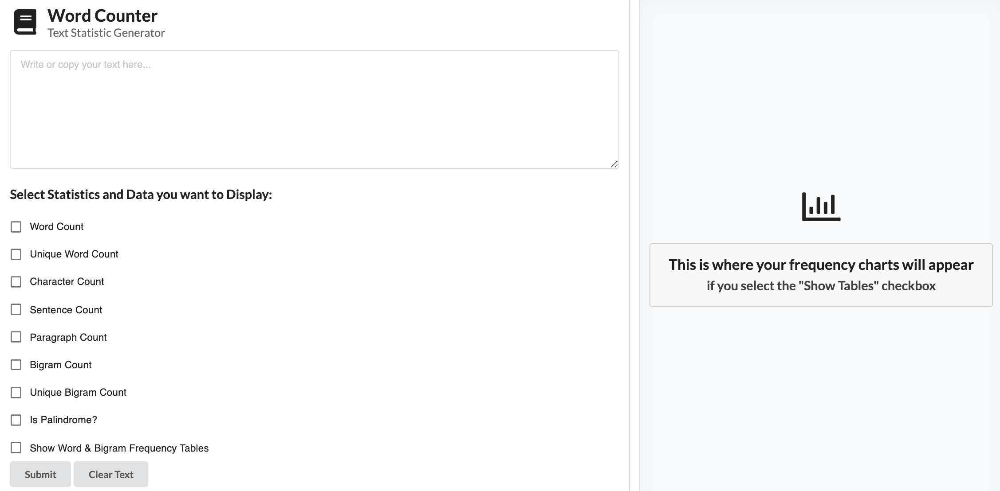

# Word Counter Challenge
A React web application that displays a variety of statistics of input text based on user selection.

[Click here to see the deployed site](https://wordcountchallenge.herokuapp.com/)

## Description
***
A user can write or paste text into the input form, then they select the different analysis they want to see of that text.
They can display:
- Word Count
- Number of Unique Words
- Character Count
- Sentence Count
- Number of Paragraphs
- Number of [Bigrams](https://en.wikipedia.org/wiki/Bigram) (pairs of adjacent words)
- Unique Bigram Count
- Whether it is a Palindrome

If they select the option they can also display tables listing all the words and their frequency, and all bigrams and their frequency.

## Dependencies
***
- babel/core: "^7.14.6",
- material-ui/core: "^4.11.4",
- jest: "^5.11.4",
- react: "^17.0.2",
- react-dom: "^17.0.2",
- react-scripts: "4.0.3",

## Installation
***
- Fork and clone this repo
- In project root directory, run:
```
    npm install
```
- To run the local dev server, run:
```
    npm start
```
- Navigate to `http://localhost:3000/` to use the app

## Technologies
***
The app is built with:
- Node
- React
- Webpack

And styled with:

- Material UI
- Semantic UI

Javascript transpiled using Babel.

## Author
***
## [Veronica Tomchak](https://www.linkedin.com/in/veronica-tomchak/)

## Screenshots
***
**Before user inputs text or makes selection**



**User inputs texts and selects statistics and data to view**


**Results!**


